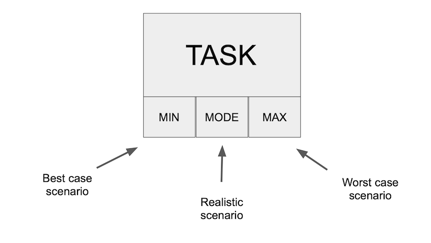
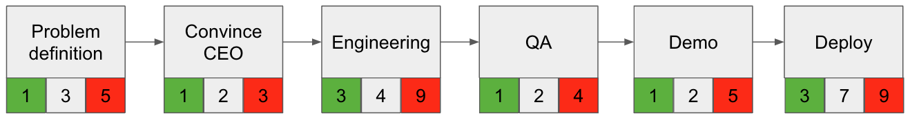
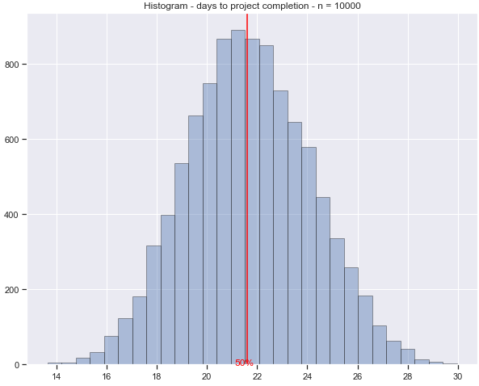
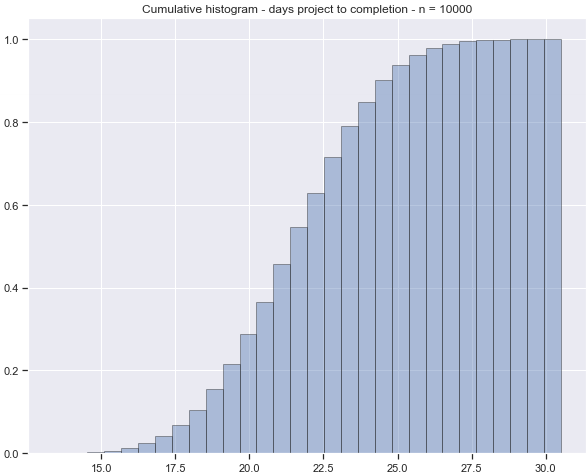

<div align="center">
  

  # Monaco

  **Probabilistic Project Planning with Monte Carlo Simulation**

  [](LICENSE)
  [](https://www.python.org)

  <p align="center">
    <a href="#features">Features</a> •
    <a href="#installation">Installation</a> •
    <a href="#quick-start">Quick Start</a> •
    <a href="#monte-carlo-simulation">Monte Carlo</a>
  </p>
</div>

---

## Why Monaco?

Estimating the time it takes to complete a task or project is hard. Traditional approaches use fixed estimates, but this ignores any uncertainty and life often gets in the way.

**Monaco helps you make better estimates by modeling tasks as random processes**, accounting for uncertainty and task dependencies through Monte Carlo simulation.

## Features

- **Probabilistic Task Modeling** - Define tasks with min/max/mode duration ranges
- **Task Dependencies** - Support for parallel and sequential task execution
- **Monte Carlo Simulation** - Run thousands of simulations to estimate project completion
- **Statistical Analysis** - Get percentiles, confidence intervals, and key metrics
- **Visualization** - Generate histogram and cumulative distribution plots
- **Export Results** - Save results to JSON or CSV for further analysis

---

## Installation

```bash
pip install monaco
```

---

## Quick Start

### Define Tasks with Uncertainty

Instead of saying "this task takes 5 days", Monaco lets you model uncertainty:

```python
from monaco import Task

task = Task(
    name='Develop Feature',
    min_duration=3,  
    mode_duration=5,  # most likely estimate
    max_duration=9,  
    estimator='triangular'  
)
```

<div align="center">
  
</div>

### Build Projects with Dependencies

Create complex project workflows with parallel and sequential task execution:

```python
from monaco import Task, Project

# Create a project
project = Project(name='Web App Development', unit='days')

# Define tasks
design_ui = Task(name='Design UI', min_duration=2, mode_duration=3, max_duration=5, estimator='triangular')
develop_frontend = Task(name='Develop Frontend', min_duration=5, mode_duration=7, max_duration=10, estimator='triangular')
develop_backend = Task(name='Develop Backend', min_duration=4, mode_duration=6, max_duration=9, estimator='triangular')
testing = Task(name='Testing', min_duration=2, mode_duration=3, max_duration=5, estimator='triangular')
deploy = Task(name='Deploy', min_duration=1, max_duration=2, estimator='uniform')

# Add tasks with dependencies
project.add_task(design_ui)
project.add_task(develop_frontend, depends_on=[design_ui])           # Sequential: frontend needs UI design
project.add_task(develop_backend)                                    # Parallel: backend runs independently
project.add_task(testing, depends_on=[develop_frontend, develop_backend])  # Waits for both tracks
project.add_task(deploy, depends_on=[testing])
```

<div align="center">
  
</div>

---

## Monte Carlo Simulation

Monaco uses [Monte Carlo simulation](https://en.wikipedia.org/wiki/Monte_Carlo_method) to estimate project completion time. By running thousands of simulations, it leverages the [Central Limit Theorem](https://en.wikipedia.org/wiki/Central_limit_theorem) to provide probabilistic estimates for the completion of tasks and projects.

### Run Simulation & Get Statistics

```python
# Get comprehensive statistics of the simulation
stats = project.statistics(n=10000)

print(f"Median completion time: {stats['median']:.1f} days")
print(f"90% confidence: {stats['percentiles']['p90']:.1f} days")
print(f"95% confidence: {stats['percentiles']['p95']:.1f} days")
```

### Visualize Results

```python
# Generate histogram
project.plot(n=10000, hist=True)
```

<div align="center">
  
</div>

### Cumulative Distribution

Read the likelihood of completing your project by a given date:

```python
# Generate cumulative distribution
project.plot(n=10000, hist=False)
```

<div align="center">
  
</div>

The cumulative distribution shows the probability of completing the project within a given timeframe, accounting for both parallel and sequential task execution.

---

## Advanced Features

### Export Results

```python
# Export to JSON
project.export_results(n=10000, format='json', filename='results.json')

# Export to CSV
project.export_results(n=10000, format='csv', filename='results.csv')
```

### Custom Estimators

Monaco supports two probability distributions:
- **Triangular**: Best when you have a most-likely estimate (min, mode, max)
- **Uniform**: When all durations in the range are equally likely (min, max)

---

## License

This project is licensed under the MIT License - see the [LICENSE](LICENSE) file for details.

---

<div align="center">
  <sub>Built with Monte Carlo simulation for better project planning</sub>
</div>
