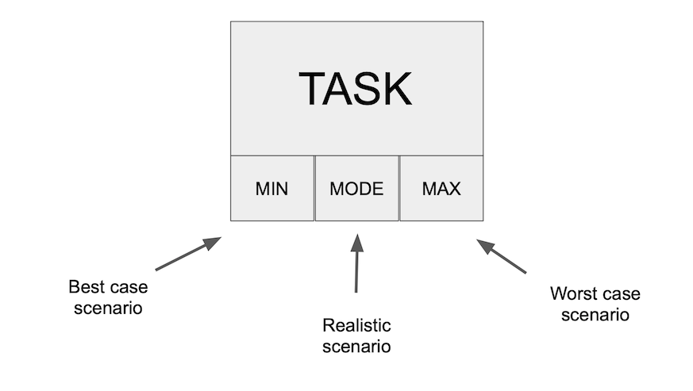
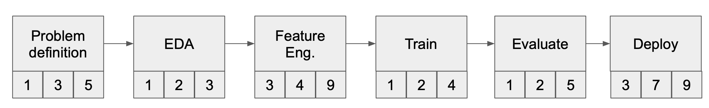
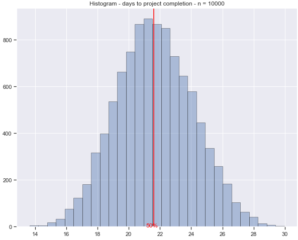
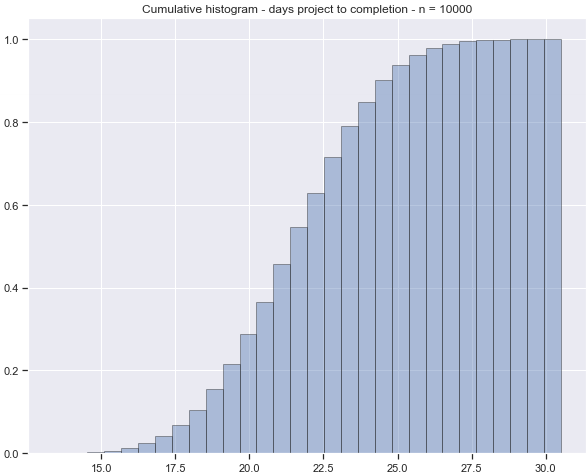

<h1 align="left">
monaco

</h1>

 
 
 
 

Estimating the time it takes to complete a task or project is one the 
biggest challenges in task and project planning. Task duration depends on many 
factors that can not always be controlled or foreseen. Monaco helps you make 
better task estimations by modeling tasks as **random processes**.

<h1 align="center">

</h1>
 

Defining a **Task** is easy:

    task = Task(name='Task', min=3, mode=4, max=9, estimator='triangular')

 

**Projects** are sequences of tasks:

<h1 align="center">

</h1>

 

**Tasks** can be added to **Projects**:

    # initiate project
    p = Project(name='My Example Project')

    # define tasks and duration in number of days
    t1 = Task(name='Problem definition', min=1, max=5, estimator='uniform')
    t2 = Task(name='EDA', min=1, mode=2, max=3, estimator='uniform')
    
    # define task sequence
    p.add_task(t1)
    p.add_task(t2)
 
 

## Monte Carlo Simulation

Monaco can estimate the duration of a project through Monte Carlo Simulation 
of many project cycles. The central limit theorem guarantees that the sum of 
many independent random processes approaches a normal distribution.   

 

**Monte Carlo Simulation** can be done with a single line of code:

    plot_data = p.plot(n=10000)

  

 

The **likelihood of completing a project** can be read from the 
cumulative distribution. In this example there is an 80% chance that the 
project will be completed under 23 days.

  

